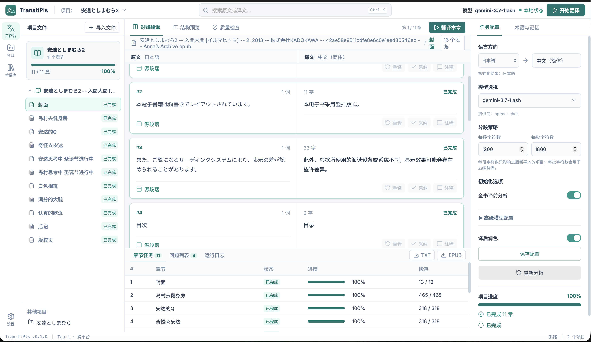
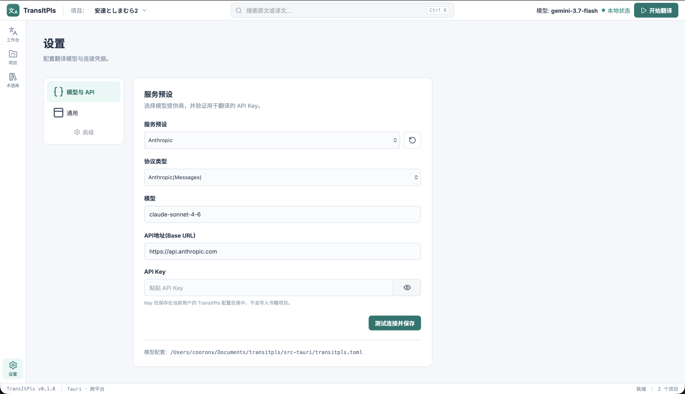
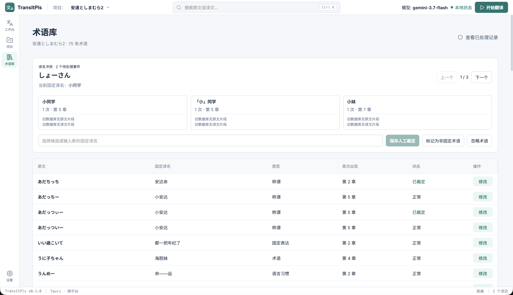

<a id="readme-top"></a>

[![contributors][contributors-shield]][contributors-url]
[![forks][forks-shield]][forks-url]
[![stars][stars-shield]][stars-url]
[![issues][issues-shield]][issues-url]

<div align="center">
  
  <h1>TransItPls</h1>
  <p>
    面向长篇文档的 AI 翻译工作台
    <br />
    <a href="https://github.com/cooronx/transitpls"><strong>查看项目 »</strong></a>
    ·
    <a href="https://github.com/cooronx/transitpls/issues">报告问题</a>
  </p>
</div>

TransItPls（译境）是一款基于 Tauri、React 和 Rust 构建的本地桌面应用，面向 EPUB 与 TXT 长篇内容翻译。它将全书分析、分段翻译、上下文维护、术语管理、质量检查和成品导出整合在同一套工作流中。



<details>
  <summary>目录</summary>
  <ol>
    <li><a href="#主要功能">主要功能</a></li>
    <li><a href="#界面预览">界面预览</a></li>
    <li><a href="#快速开始">快速开始</a></li>
    <li><a href="#命令行工具">命令行工具</a></li>
    <li><a href="#配置说明">配置说明</a></li>
    <li><a href="#数据与隐私">数据与隐私</a></li>
    <li><a href="#参与贡献">参与贡献</a></li>
  </ol>
</details>

## 主要功能

- 导入并解析 EPUB、TXT 文件，按内容哈希创建可恢复的本地翻译项目。
- 在翻译前分析全书语言、文风、章节摘要和整体梗概，为后续批次提供一致上下文。
- 按章节和字符预算分批翻译，保存每批结果；任务中断后可以从已有进度继续。
- 支持 OpenAI Chat Completions、OpenAI Responses 和 Anthropic Messages 协议，可配置兼容接口、模型、超时与重试策略。
- 自动提取术语并维护术语库，保留译名冲突供人工裁定，也可重新翻译受影响内容。
- 支持译后润色、单段重译、运行日志和 Token 用量记录。
- 将完成的项目导出为 TXT 或 EPUB，并同步翻译后的章节标题与目录。
- 同时提供桌面界面和 CLI；`--mock` 模式无需 API Key 即可离线体验主要流程。

<p align="right">（<a href="#readme-top">返回顶部</a>）</p>

## 界面预览

### 项目管理

集中查看本地翻译项目、章节总数和完成进度，也可以直接导入新书。


### 翻译工作台

对照查看原文与译文，按章节跟踪翻译任务，并在侧栏调整语言、模型、分段和分析策略。


### 模型与 API

选择服务预设或填写兼容接口，在应用内测试连接后保存。API Key 仅保存在当前用户的 TransItPls 配置目录中。



### 术语与译名冲突

浏览项目术语、修改固定译名，并对同一原文的多个候选译名进行人工裁定和影响范围重译。




<p align="right">（<a href="#readme-top">返回顶部</a>）</p>

## 快速开始

请先安装 Node.js、Yarn、Rust，以及当前平台所需的 Tauri 系统依赖。

```bash
git clone https://github.com/cooronx/transitpls.git
cd transitpls
yarn install
yarn tauri dev
```

应用启动后，在“设置 → 模型与 API”中选择服务商、填写模型与 API Key，并测试连接。随后进入“项目”导入 EPUB 或 TXT 文件，即可初始化并开始翻译。

只需检查前端构建时，可以运行：

```bash
yarn build
```

<p align="right">（<a href="#readme-top">返回顶部</a>）</p>

## 命令行工具

CLI 位于 `src-tauri`，可直接通过 Cargo 运行：

```bash
cd src-tauri

# 初始化、查看状态与翻译
cargo run --bin transitpls-cli -- init book.epub
cargo run --bin transitpls-cli -- status book.epub
cargo run --bin transitpls-cli -- transit book.epub

# 离线模拟，或只翻译指定章节（章节序号从 0 开始）
cargo run --bin transitpls-cli -- init book.epub --mock
cargo run --bin transitpls-cli -- transit book.epub --chapter 0 --mock

# 管理术语、执行质量检查并导出结果
cargo run --bin transitpls-cli -- terms list book.epub
cargo run --bin transitpls-cli -- terms conflicts book.epub
cargo run --bin transitpls-cli -- terms resolve book.epub "source" "fixed target"
cargo run --bin transitpls-cli -- review book.epub
cargo run --bin transitpls-cli -- export --format epub book.epub
```

项目默认保存在 `projects/<source-sha256>/` 下。重复执行翻译命令时，TransItPls 会读取已经保存的章节和分段进度，不会覆盖已完成的译文。

<p align="right">（<a href="#readme-top">返回顶部</a>）</p>

## 配置说明

CLI 默认读取当前目录下的 `transitpls.toml`。可以复制示例配置后按需修改：

```bash
cp transitpls.toml.example transitpls.toml
```

主要配置包括：

- `language`：源语言与目标语言；源语言设为 `auto` 时由模型识别。
- `llm`：协议类型、接口地址、模型、API Key 环境变量、超时和重试次数。
- `segment`：单段与单批次的最大字符数。
- `analysis`：是否启用全书分析。
- `pipeline`：译后润色和近期上下文字符预算。
- `paths`：项目状态目录。
- `general`：界面可见段落数和重译并发数。

CLI 参数优先于 TOML 配置，TOML 配置优先于内置默认值。也可以使用全局参数 `--config <path>` 指定其他配置文件。

<p align="right">（<a href="#readme-top">返回顶部</a>）</p>

## 数据与隐私

- 原文、译文、术语库、日志和用量数据均保存在本地项目目录中。
- 桌面端 API Key 保存在当前用户的 TransItPls 配置目录，不会写入项目文件。
- CLI 用户可以通过 `llm.api_key_env` 指定环境变量，例如 `OPENAI_API_KEY`。
- 使用在线模型时，待翻译内容会发送至你所配置的模型服务商；具体数据处理方式以该服务商政策为准。
- 同一个项目使用操作系统文件锁，避免多个任务同时写入造成状态损坏。

<p align="right">（<a href="#readme-top">返回顶部</a>）</p>

## 参与贡献

欢迎提交 [Issue](https://github.com/cooronx/transitpls/issues) 和 Pull Request。报告问题时，请尽量附上 TransItPls 版本、操作系统、复现步骤及相关日志，并避免在截图或日志中暴露 API Key。

<p align="right">（<a href="#readme-top">返回顶部</a>）</p>

[contributors-shield]: https://img.shields.io/github/contributors/cooronx/transitpls.svg?style=for-the-badge
[contributors-url]: https://github.com/cooronx/transitpls/graphs/contributors
[forks-shield]: https://img.shields.io/github/forks/cooronx/transitpls.svg?style=for-the-badge
[forks-url]: https://github.com/cooronx/transitpls/network/members
[stars-shield]: https://img.shields.io/github/stars/cooronx/transitpls.svg?style=for-the-badge
[stars-url]: https://github.com/cooronx/transitpls/stargazers
[issues-shield]: https://img.shields.io/github/issues/cooronx/transitpls.svg?style=for-the-badge
[issues-url]: https://github.com/cooronx/transitpls/issues
